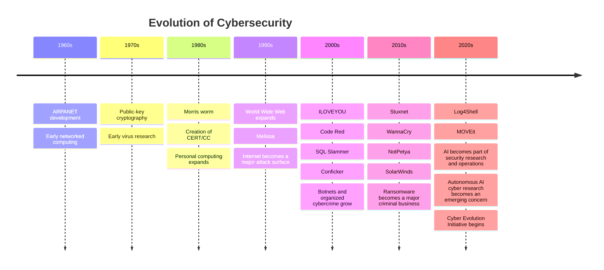

# 🧭 Cybersecurity Evolution Timeline

This is the high-level timeline for CEI.

It is **not** supposed to be a complete history of cybersecurity. It's a starting point for seeing how major technologies, incidents, and defensive changes line up over time.

## Why This Exists

CEI is interested in how one change can create another.

New technology changes the attack surface.

Attackers adapt.

Defenders adapt.

Then the technology changes again.

The point of this timeline is to give that cycle some historical context.

## Important Note

This timeline will change.

As CEI grows, entries should be replaced or expanded with links to detailed incident records, technical reports, research papers, and other primary evidence.

A date on this page is only the beginning. The deeper research belongs in the connected records behind it.
