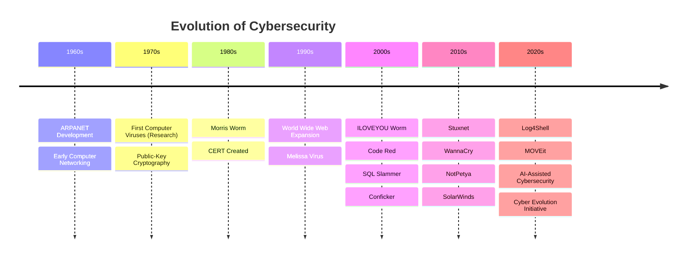

# Cyber Evolution Timeline

```mermaid
timeline
    title Evolution of Cybersecurity

    1960s : ARPANET Development
            : Early Computer Networking

    1970s : First Computer Viruses (Research)
            : Public-Key Cryptography

    1980s : Morris Worm
            : CERT Created

    1990s : World Wide Web Expansion
            : Melissa Virus

    2000s : ILOVEYOU Worm
            : Code Red
            : SQL Slammer
            : Conficker

    2010s : Stuxnet
            : WannaCry
            : NotPetya
            : SolarWinds

    2020s : Log4Shell
            : MOVEit
            : AI-Assisted Cybersecurity
            : Cyber Evolution Initiative
```
